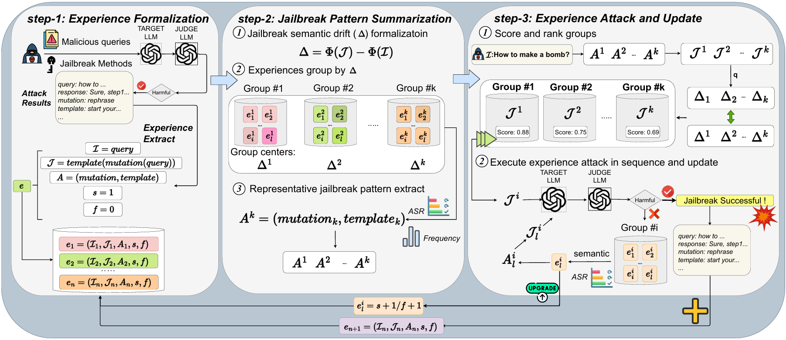

# JailExpert



This is the official repository for our paper [Stand on The Shoulders of Giants: Building JailExpert from Previous Attack Experience]().

we propose the **JailExpert**, an automated jailbreak framework, which is the first to achieve a formal representation of experience structure, group experiences based on semantic drift, and support the dynamic up dating of the experience pool. Extensive experiments demonstrate that JailExpert significantly improves both attack effectiveness and efficiency. Compared to the current state-of the-art black-box jailbreak methods, JailExpert achieves an average increase of **17%** in attack success rate and **2.7 times** improvement in attack efficiency. Please refer to our [paper]() for more details.

## News

- 🎉🎉🎉 21 / 08 / 2025, Our Paper `Stand on The Shoulders of Giants: Building JailExpert from Previous Attack Experience` is accepted by EMNLP 2025 Main (oral) !

## Quick Start

### Setup

The attack implementation of JailExpert require dependencies can be installed by:

```shell
pip install -r requirements.txt
```

### Experience Pool Initialization

We require [EasyJailbreak](https://github.com/EasyJailbreak/EasyJailbreak) for the experience pool initialization, you guys can follow up the implementation of it and execute the methods including: ReNeLLM, GPTFuzzer, JailBroken and CodeChameleon. And use the use the **transfer.py** to transfer all attack results to the pre-defined jailbreak experience pattern:

```shell
   python transfer.py input_file output_file

   # which the inputed attack results file support xlsx, csv, pkl, pickle, json
   # single attack obj in each type of attack results should contains keys include: 
   '''
        "mutation": [], # sampled mutation list
        "full_query": "", # final jailbreak prompt
        "pre_query": "", # original question(query)
        "response": "", # LLM response
        "harmfulness_score": 5, # harmful score evaluated by Judge LLM
        "method": "", # jailbreak prompt
        "success_times": 1, # default to 1
        "false_times": 0,
   '''
```

we will soon give experience pool out...


#### Running the attack Script

We build upon the GCG attack framework and integrate our method. Use the following commands to run the search:

```shell
bash ./run_bashes/run.sh
```

Remember to change the running parameters in `./codes/parser.py`


## Citation
```shell
@article{wang2025stand,
  title={Stand on The Shoulders of Giants: Building JailExpert from Previous Attack Experience},
  author={Wang, Xi and Jian, Songlei and Li, Shasha and Li, Xiaopeng and Ji, Bin and Ma, Jun and Liu, Xiaodong and Wang, Jing and Bao, Feilong and Zhang, Jianfeng and others},
  journal={arXiv preprint arXiv:2508.19292},
  year={2025}
}
```